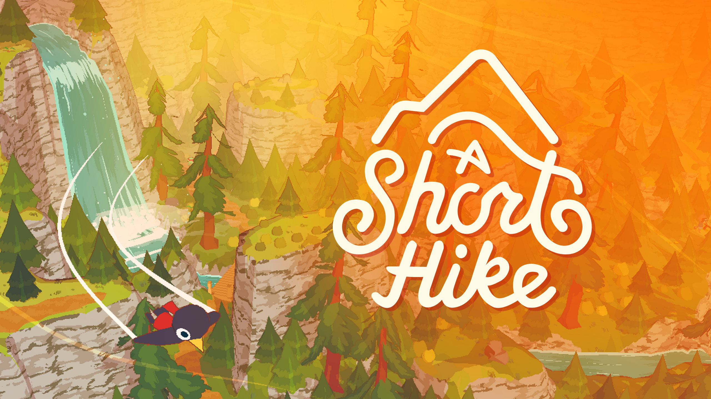

**[ashorthike.com](https://ashorthike.com/)**

---

## Deutsch

Eine inoffizielle deutsche Übersetzung von *A Short Hike*. Claire wandert jetzt auch auf Deutsch.

### Installation

**macOS**

1. Lade dieses Repository herunter.
2. Öffne ein Terminal im heruntergeladenen Ordner.
3. Führe aus:
   ```bash
   ./install.sh
   ```
4. Starte das Spiel. Wähle Deutsch in den Spracheinstellungen.

**Windows / Linux**

1. Finde deinen Spielordner. Steam zeigt ihn dir über *A Short Hike → Verwalten → Lokale Dateien durchsuchen*.
2. Suche darin die Datei `_LANG_Custom.yarn_lines.csv`.
3. Lege `LANG_German.yarn_lines.csv` aus diesem Repository in denselben Ordner.
4. Starte das Spiel. Wähle Deutsch in den Spracheinstellungen.

---

## English

An unofficial German translation of *A Short Hike*. Claire hikes in German now too.

### Installation

**macOS**

1. Download this repository.
2. Open a terminal in the downloaded folder.
3. Run:
   ```bash
   ./install.sh
   ```
4. Launch the game. Select German in the language settings.

**Windows / Linux**

1. Find your game folder. Steam shows you via *A Short Hike → Manage → Browse Local Files*.
2. Look for the file `_LANG_Custom.yarn_lines.csv` inside it.
3. Put `LANG_German.yarn_lines.csv` from this repository in the same folder.
4. Launch the game. Select German in the language settings.
